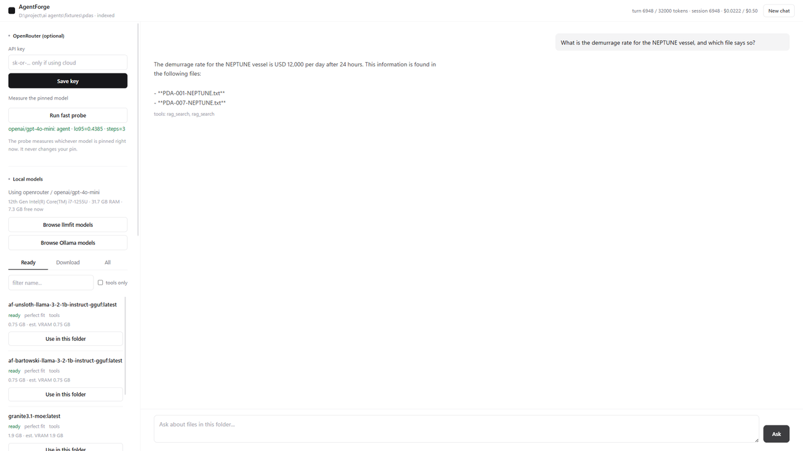
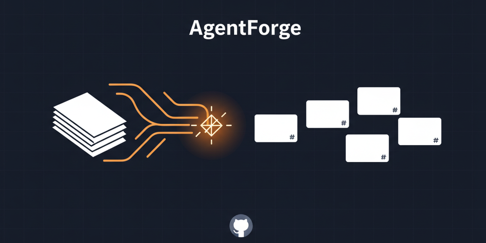
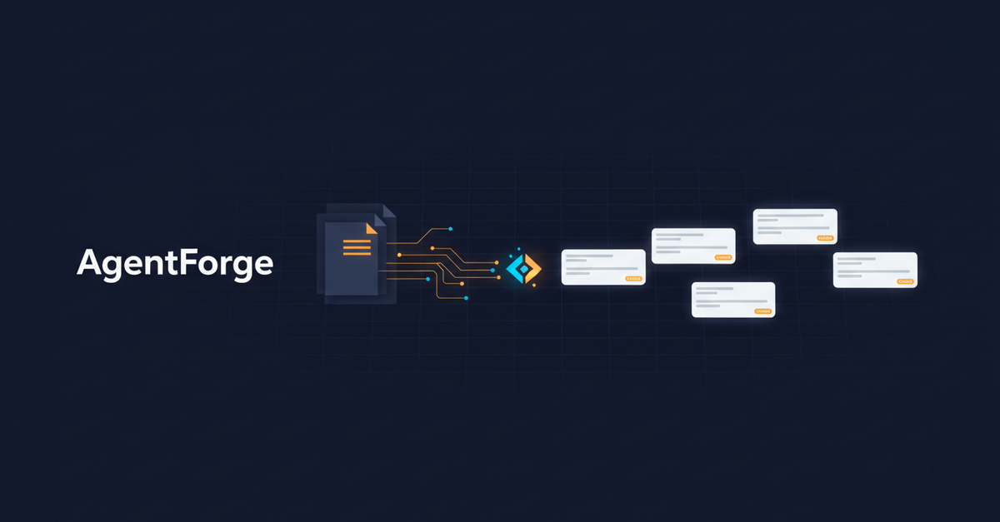

# AgentForge

OpenRouter-first tool-using agent. v1 tools: `rag_search` (hybrid FTS5 + vectors), `fs_list`, `fs_read`. Indexes PDF / txt / md (not `.docx`).

The UI lists **llmfit** and **Ollama** on the left, with install / download links. Workspace files and the chat can be downloaded from the same sidebar.

## Demo

A narrated three-minute walkthrough: the commit history, every sidebar panel, a cited answer, the write-permission diff gate, and the code behind them.

[](docs/media/agentforge-demo.mp4)

Click the poster to open [`docs/media/agentforge-demo.mp4`](docs/media/agentforge-demo.mp4) (1080p, 2:58, 34 MB). GitHub plays it in the file viewer.

What the video shows, in order:

1. Repo, commit history, and the two QA reports (13 defects found, 172 tests green).
2. `agentforge --dir <folder>`: first launch extracts text and builds the hybrid index.
3. OpenRouter key + **Run fast probe**: measures the pinned model, never replaces it.
4. Local models: Ollama tags plus the llmfit browser filtered to what fits this PC.
5. A cited answer over the folder, with the tool trace under the reply.
6. **Ask** permission: a unified diff before any write lands on disk.
7. `dedupe_results`, the six write gates in `files_write.py`, and `blocked_component` in `paths.py`.

Social cards (generated for the project):

| GitHub | LinkedIn |
| --- | --- |
|  |  |

### Tech stack

- **API and UI:** FastAPI + Uvicorn serving one hand-written vanilla JavaScript page. CORS names the bound origin.
- **Agent loop:** LangGraph + langchain-core. infer → validate (JSON Schema) → execute tools → budgets.
- **Providers:** LiteLLM. OpenRouter first, Ollama runtime for local models, llama.cpp behind a flag.
- **Retrieval:** SQLite FTS5 + LanceDB hybrid index, one `rag_search` tool with citations.
- **Documents:** pypdf for PDF, plus txt and md.
- **Local fit:** llmfit ranks ~11k models against this machine's RAM/VRAM and downloads GGUFs; Ollama runs them.
- **Safety:** five-step capability probe with a Wilson lower bound; six gates and a backup before any write.
- **Data:** SQLite (sessions, traces, probe cards, settings) and Pydantic v2 models.
- **Tooling:** uv, pytest (172 tests), Playwright, GitHub Actions.

The demo assets were produced with Playwright (screenshots), OpenRouter text-to-speech (`deepgram/flux-tts`), and ffmpeg; the intro clip is `minimax/hailuo-3-max` and the cards are `google/gemini-2.5-flash-image`, both via OpenRouter.

## Run from Downloads (or any folder)

`uv run agentforge` looks for a **local** `pyproject.toml`. There is none in Downloads, so you get `Failed to spawn: agentforge`.

PyPI also has an **unrelated** `agentforge` with no CLI. `uvx agentforge` installs that other package.

**Install once, then run from anywhere:**

```powershell
uv tool install git+https://github.com/vinothhacks/agentforge.git
agentforge --dir "C:\Users\sm2063\Documents\Vinoth_N_Package_v1"
```

Upgrade after a git push:

```powershell
uv tool install --force git+https://github.com/vinothhacks/agentforge.git
```

**One-shot (no install):**

```powershell
uvx --from git+https://github.com/vinothhacks/agentforge.git agentforge --dir "C:\Users\sm2063\Documents\Vinoth_N_Package_v1"
```

Same thing via `uv run` (note `--no-project --with`):

```powershell
uv run --no-project --with git+https://github.com/vinothhacks/agentforge.git agentforge --dir "C:\Users\sm2063\Documents\Vinoth_N_Package_v1"
```

Paste an OpenRouter key in the UI and ask about the folder. First launch ingests PDF text and builds both indexes.

Re-extract / re-index:

```powershell
agentforge --ingest --dir "C:\Users\sm2063\Documents\Vinoth_N_Package_v1"
```

Local models:

- [Download Ollama](https://ollama.com/download)
- [llmfit on PyPI](https://pypi.org/project/llmfit/) or `uv tool install llmfit` (also a button in the UI)

## From a clone

`uv run agentforge` works **only** after `cd` into this repo:

```powershell
git clone https://github.com/vinothhacks/agentforge.git
cd agentforge
uv run agentforge --dir "C:\Users\sm2063\Documents\Vinoth_N_Package_v1"
```

From another folder, point uv at the clone:

```powershell
uv run --directory path\to\agentforge agentforge --dir "C:\Users\sm2063\Documents\Vinoth_N_Package_v1"
```

## PDF extract benchmark

Benchmark is **pypdf extract** on four downloaded public PDFs (40 pages). Not a synthetic sample set.

| PDFs | Pages | Text layer | Chars | Fail |
| --- | --- | --- | --- | --- |
| 4 | 40 | **3 / 4 (75%)** | 113,239 | 1 scanned FONASBA PDF (OCR out of v1) |

Full table and previews: [BENCHMARK.md](BENCHMARK.md). Reproduce: `uv run python scripts/benchmark_pdf_extract.py`.

## Probe (optional)

```powershell
agentforge --experiment
```

Mail, MCP, web search, long-term memory, and a shell are out of v1.

Python 3.11+.
